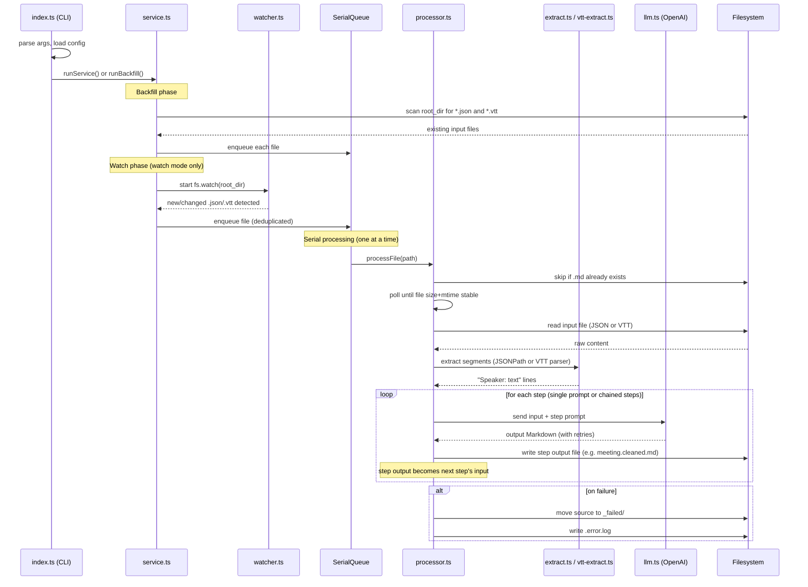

# cassette

Automatically watches a meeting transcript directory for JSON and VTT files, sends transcript content to an OpenAI-compatible endpoint, and writes cleaned Markdown next to each input file.

## Flow



## Install

```bash
bun install
```

## Configure

Create config at:

- `$XDG_CONFIG_HOME/cassette/config.yaml`, or
- `~/.config/cassette/config.yaml`

Example:

```yaml
watch:
  root_dir: ~/Documents/meetings
  stable_window_ms: 3000

# transcript.path is optional (defaults to "$[*]"), only used for JSON files.
# VTT files are parsed natively and ignore this section.
transcript:
  path: "$[*]" # MacWhisper exports a root-level array
  speaker_field: speaker
  text_field: text

prompt: |
  You are a meeting transcript editor. Clean up this raw transcript...
```

### Prompt chaining

You can chain multiple LLM calls with `steps:` instead of a single `prompt:`. Each step's output becomes the next step's input, and each step writes its own output file.

```yaml
steps:
  - name: clean
    suffix: ".cleaned.md"
    prompt: |
      You are a transcript editor. Clean up this raw transcript...

  - name: summarize
    suffix: ".summary.md"
    prompt: |
      Summarize the cleaned transcript below...
```

Given `meeting-2024-01-15.json` (or `meeting-2024-01-15.vtt`), this produces:

- `meeting-2024-01-15.cleaned.md` - output of the clean step
- `meeting-2024-01-15.summary.md` - output of the summarize step (input: cleaned transcript)

Each step accepts:

- `name` (required) - identifies the step in logs and error reports
- `prompt` (required) - the prompt sent to the LLM along with the current input
- `suffix` (optional) - output filename suffix; defaults to `output.markdown_suffix`
- `llm` (optional) - per-step LLM overrides (any field from the top-level `llm:` block)

You must use either `prompt:` or `steps:`, not both.

Full example with all options: `config.example.yaml`

Generate starter config automatically:

```bash
bun run index.ts init
```

Force overwrite existing config:

```bash
bun run index.ts init --force
```

Set credentials:

```bash
cp .env.example .env
# then edit .env and fill in your key
```

Bun automatically loads `.env` at startup. Alternatively, export it directly:

```bash
export OPENAI_API_KEY="..."
```

## Run

One-off backfill:

```bash
bun run index.ts --once
```

Long-running watch mode:

```bash
bun run index.ts
```

Custom config path:

```bash
bun run index.ts --config /path/to/config.yaml
```

Show help:

```bash
bun run index.ts --help
```

## Test

```bash
bun test
```

## macOS LaunchAgent

See `docs/launchagent.md`.
