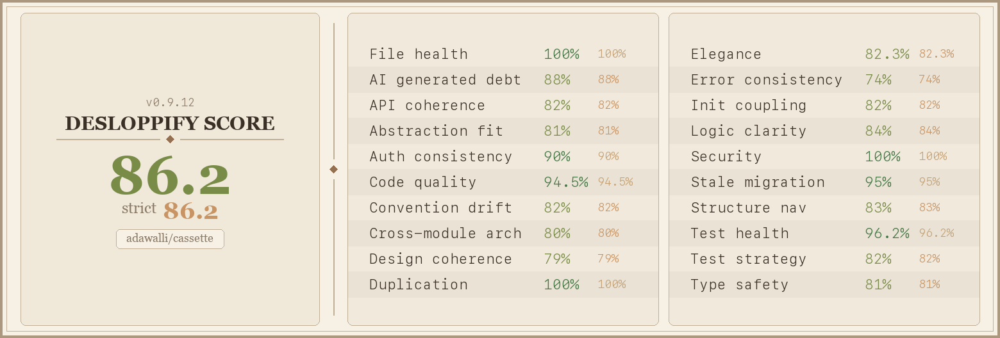
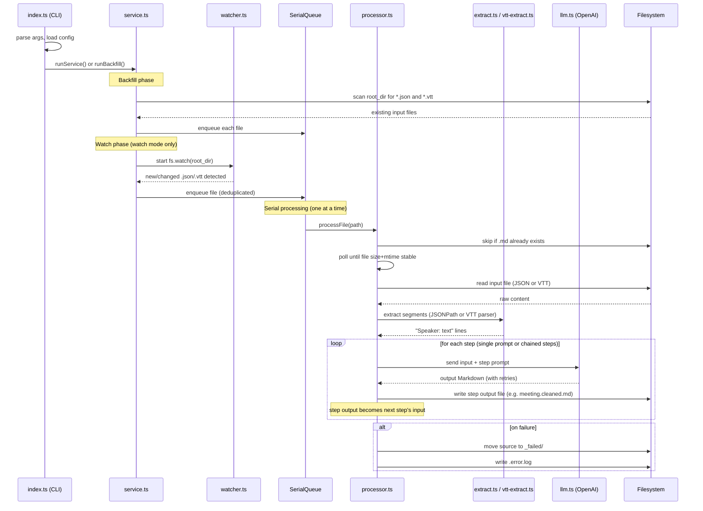

# cassette

[](https://www.npmjs.com/package/@cassette-meetings/cli)
[](https://codecov.io/gh/adawalli/cassette)



Automatically watches a meeting transcript directory for JSON and VTT files, sends transcript content to an OpenAI-compatible endpoint, and writes cleaned Markdown next to each input file.

## Flow



## Install

Try it without installing:

```bash
npx @cassette-meetings/cli --help
bunx @cassette-meetings/cli --help
```

For regular use, install globally so `cassette` is available as a command:

```bash
bun add -g @cassette-meetings/cli   # recommended
# or, if you prefer npm:
npm install -g @cassette-meetings/cli
```

## Configure

Create config at:

- `$XDG_CONFIG_HOME/cassette/config.yaml`, or
- `~/.config/cassette/config.yaml`

Example:

```yaml
watch:
  root_dir: ~/Documents/meetings
  stable_window_ms: 3000

output:
  copy_to: ~/notes/meetings
  # copy_filename: "{{date}} {{title}}"  # optional template for copied filenames
  # stem_strip: "_[a-f0-9]{4,8}$"       # regex to clean unwanted suffixes from {{stem}}

# transcript.path is optional (defaults to "$[*]"), only used for JSON files.
# VTT files are parsed natively and ignore this section.
transcript:
  path: "$[*]" # MacWhisper exports a root-level array
  speaker_field: speaker
  text_field: text

prompt: |
  You are a meeting transcript editor. Clean up this raw transcript...
```

When `copy_to` is set, processed files are copied to that directory. The optional `copy_filename` field controls the copied filename using template variables:

| Variable | Description |
|----------|-------------|
| `{{date}}` | Recording date in `YYYY-MM-DD` format |
| `{{stem}}` | Filename without extension and leading date |
| `{{title}}` | YAML front matter `title` field (falls back to `{{stem}}`) |

The `.md` extension is appended automatically. Do not include it in the template - `"{{date}} {{title}}"` produces `2026-03-20 Weekly Standup.md`. If the template already ends with `.md` it won't be doubled.

Without `copy_filename`, files are named `{{date}} {{stem}}.md` by default.

### Cleaning up `{{stem}}`

Some transcript tools append uniqueness hashes to filenames (e.g. `weekly-standup_36f1f8.vtt`). The `stem_strip` option removes unwanted patterns from the stem using regex before it's used in templates or default naming.

```yaml
output:
  stem_strip: "_[a-f0-9]{4,8}$"
```

This turns `weekly-standup_36f1f8` into `weekly-standup`. You can also pass an array of patterns - they're applied in order:

```yaml
output:
  stem_strip:
    - "_[a-f0-9]{4,8}$"
    - "-copy$"
```

Patterns are applied after the leading/trailing date is removed from the stem, so they don't need to account for the date portion. If stripping removes the entire stem, the original value is kept as a safety net.

For `{{title}}` to resolve, the final step's output must contain a YAML front matter block with a `title` field. If the title is missing, empty, or the front matter is malformed, `{{title}}` falls back to `{{stem}}`.

### Prompt chaining

You can chain multiple LLM calls with `steps:` instead of a single `prompt:`. Each step's output becomes the next step's input, and each step writes its own output file.

```yaml
steps:
  - name: clean
    suffix: ".cleaned.md"
    prompt: |
      You are a transcript editor. Clean up this raw transcript...

  - name: summarize
    suffix: ".summary.md"
    prompt: |
      Summarize the cleaned transcript below...
```

Given `meeting-2024-01-15.json` (or `meeting-2024-01-15.vtt`), this produces:

- `meeting-2024-01-15.cleaned.md` - output of the clean step
- `meeting-2024-01-15.summary.md` - output of the summarize step (input: cleaned transcript)

Each step accepts:

- `name` (required) - identifies the step in logs and error reports
- `prompt` (required) - the prompt sent to the LLM along with the current input
- `suffix` (optional) - output filename suffix; defaults to `output.markdown_suffix`
- `llm` (optional) - per-step LLM overrides (any field from the top-level `llm:` block)

You must use either `prompt:` or `steps:`, not both.

Full example with all options: [config.example.yaml](config.example.yaml)

Generate starter config automatically:

```bash
cassette init
```

Force overwrite existing config:

```bash
cassette init --force
```

Set credentials:

```bash
cp .env.example .env
# then edit .env and fill in your key
```

If you run via Bun, it loads `.env` automatically. If you run via Node/npx, export the variable manually:

```bash
export OPENAI_API_KEY="..."
```

## Run

One-off backfill:

```bash
cassette --once
```

Long-running watch mode:

```bash
cassette
```

Custom config path:

```bash
cassette --config /path/to/config.yaml
```

Show help:

```bash
cassette --help
```

## macOS LaunchAgent

See [docs/launchagent.md](docs/launchagent.md).

## Contributing

See [DEVELOPER.md](DEVELOPER.md) for setup, development workflow, and publishing instructions.
