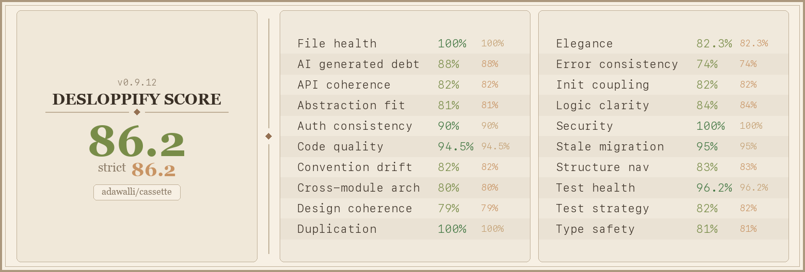
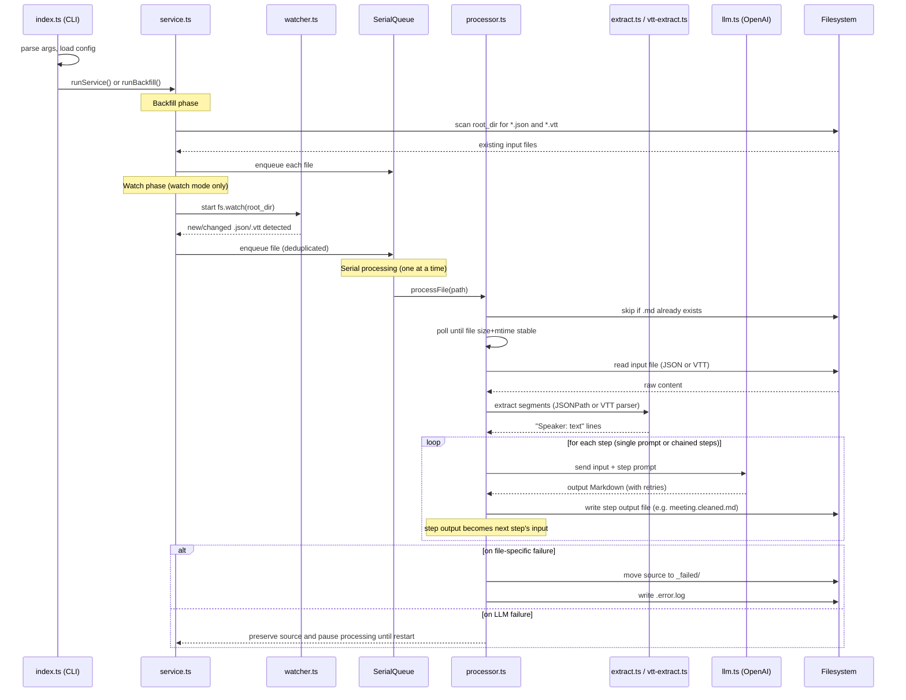

# cassette

[](https://www.npmjs.com/package/@cassette-meetings/cli)
[](https://codecov.io/gh/adawalli/cassette)



Automatically watches a meeting transcript directory for JSON and VTT files, sends transcript content to an OpenAI-compatible endpoint, and writes cleaned Markdown next to each input file.

## Flow


```mermaid
sequenceDiagram
    participant CLI as index.ts (CLI)
    participant Svc as service.ts
    participant Watcher as watcher.ts
    participant Queue as SerialQueue
    participant Proc as processor.ts
    participant Extract as extract.ts / vtt-extract.ts
    participant LLM as llm.ts (OpenAI)
    participant FS as Filesystem

    CLI->>CLI: parse args, load config
    CLI->>Svc: runService() or runBackfill()

    Note over Svc: Backfill phase
    Svc->>FS: scan root_dir for *.json and *.vtt
    FS-->>Svc: existing input files
    Svc->>Queue: enqueue each file

    Note over Svc: Watch phase (watch mode only)
    Svc->>Watcher: start fs.watch(root_dir)
    Watcher-->>Svc: new/changed .json/.vtt detected
    Svc->>Queue: enqueue file (deduplicated)

    Note over Queue: Serial processing (one at a time)
    Queue->>Proc: processFile(path)
    Proc->>FS: skip if .md already exists
    Proc->>Proc: poll until file size+mtime stable
    Proc->>FS: read input file (JSON or VTT)
    FS-->>Proc: raw content
    Proc->>Extract: extract segments (JSONPath or VTT parser)
    Extract-->>Proc: "Speaker: text" lines
    loop for each step (single prompt or chained steps)
        Proc->>LLM: send input + step prompt
        LLM-->>Proc: output Markdown (with retries)
        Proc->>FS: write step output file (e.g. meeting.cleaned.md)
        Note over Proc: step output becomes next step's input
    end

    alt on file-specific failure
        Proc->>FS: move source to _failed/
        Proc->>FS: write .error.log
    else on LLM failure
        Proc-->>Svc: preserve source and pause processing until restart
    end
```

## Install

Try it without installing:

```bash
npx @cassette-meetings/cli --help
bunx @cassette-meetings/cli --help
```

For regular use, install globally so `cassette` is available as a command:

```bash
bun add -g @cassette-meetings/cli   # recommended
# or, if you prefer npm:
npm install -g @cassette-meetings/cli
```

## Configure

Create config at:

- `$XDG_CONFIG_HOME/cassette/config.yaml`, or
- `~/.config/cassette/config.yaml`

Example:

```yaml
watch:
  root_dir: ~/Documents/meetings
  stable_window_ms: 3000

output:
  copy_to: ~/notes/meetings
  # copy_filename: "{{date}} {{title}}"  # optional template for copied filenames
  # stem_strip: "_[a-f0-9]{4,8}$"       # regex to clean unwanted suffixes from {{stem}}

# The whole transcript block is optional and only used for JSON files.
# VTT files are parsed natively and ignore it.
transcript:
  path: "$[*]" # MacWhisper exports a root-level array
  speaker_field: speaker
  text_field: text

prompt: |
  You are a meeting transcript editor. Clean up this raw transcript...
```

For a model that rejects the `temperature` request parameter, set `llm.temperature: null` (or `steps[].llm.temperature: null` for one step). Otherwise, temperature defaults to `0.1`. An LLM failure leaves the source and completed step outputs in place; watch mode pauses processing until restart, while `--once` exits with an error. Malformed transcript files still follow the `failure:` quarantine settings.

When `copy_to` is set, processed files are copied to that directory. The optional `copy_filename` field controls the copied filename using template variables:

| Variable    | Description                                                |
| ----------- | ---------------------------------------------------------- |
| `{{date}}`  | Recording date in `YYYY-MM-DD` format                      |
| `{{stem}}`  | Filename without extension and leading date                |
| `{{title}}` | YAML front matter `title` field (falls back to `{{stem}}`) |

The `.md` extension is appended automatically. Do not include it in the template - `"{{date}} {{title}}"` produces `2026-03-20 Weekly Standup.md`. If the template already ends with `.md` it won't be doubled.

Without `copy_filename`, files are named `{{date}} {{stem}}.md` by default.

### Cleaning up `{{stem}}`

Some transcript tools append uniqueness hashes to filenames (e.g. `weekly-standup_36f1f8.vtt`). The `stem_strip` option removes unwanted patterns from the stem using regex before it's used in templates or default naming.

```yaml
output:
  stem_strip: "_[a-f0-9]{4,8}$"
```

This turns `weekly-standup_36f1f8` into `weekly-standup`. You can also pass an array of patterns - they're applied in order:

```yaml
output:
  stem_strip:
    - "_[a-f0-9]{4,8}$"
    - "-copy$"
```

Patterns are applied after the leading/trailing date is removed from the stem, so they don't need to account for the date portion. If stripping removes the entire stem, the original value is kept as a safety net.

For `{{title}}` to resolve, the final step's output must contain a YAML front matter block with a `title` field. If the title is missing, empty, or the front matter is malformed, `{{title}}` falls back to `{{stem}}`.

### Prompt chaining

You can chain multiple LLM calls with `steps:` instead of a single `prompt:`. Each step's output becomes the next step's input, and each step writes its own output file.

```yaml
steps:
  - name: clean
    suffix: ".cleaned.md"
    prompt: |
      You are a transcript editor. Clean up this raw transcript...

  - name: summarize
    suffix: ".summary.md"
    prompt: |
      Summarize the cleaned transcript below...
```

Given `meeting-2024-01-15.json` (or `meeting-2024-01-15.vtt`), this produces:

- `meeting-2024-01-15.cleaned.md` - output of the clean step
- `meeting-2024-01-15.summary.md` - output of the summarize step (input: cleaned transcript)

Each step accepts:

- `name` (required) - identifies the step in logs and error reports
- `prompt` (required) - the prompt sent to the LLM along with the current input
- `suffix` (optional) - output filename suffix; defaults to `output.markdown_suffix`
- `llm` (optional) - per-step LLM overrides (any field from the top-level `llm:` block)
- `notify` (optional) - also fire the `on_complete` hook for this step's output

You must use either `prompt:` or `steps:`, not both. Each step must produce a distinct output file, so no two steps may share a suffix (and a step using `.md` collides with the default suffix).

### Intake

Point cassette at a download folder and it will move matching files into `root_dir` (under a `YYYY/MM-DD` week folder) before processing them:

```yaml
intake:
  source_dir: ~/Downloads
  include_glob: "**/*.vtt"
  exclude_glob: []
  delete_source: true # false copies instead of moving
```

### on_complete hook

Runs a shell command after each file finishes successfully:

```yaml
on_complete:
  command: 'terminal-notifier -title "Cassette" -message "Transcribed {{input}}"'
  timeout_ms: 10000
```

Variables: `{{input}}`, `{{output}}`, `{{root_dir}}`, plus `{{step_name}}` and `{{step_output}}` for per-step hooks fired by `notify: true`. A failing or timed-out hook is logged, never fatal.

Full example with all options: [config.example.yaml](config.example.yaml)

Generate starter config automatically:

```bash
cassette init
```

Force overwrite existing config:

```bash
cassette init --force
```

Set credentials:

```bash
cp .env.example .env
# then edit .env and fill in your key
```

If you run via Bun, it loads `.env` automatically. If you run via Node/npx, export the variable manually:

```bash
export OPENAI_API_KEY="..."
```

## Run

One-off backfill:

```bash
cassette --once
```

Long-running watch mode:

```bash
cassette
```

Custom config path:

```bash
cassette --config /path/to/config.yaml
```

Show help:

```bash
cassette --help
```

## macOS LaunchAgent

See [docs/launchagent.md](docs/launchagent.md).

## Capturing transcripts from Microsoft Teams

[`tampermonkey/teams-vtt-export.user.js`](tampermonkey/teams-vtt-export.user.js) is an optional
userscript that adds a VTT download button to Teams meeting recordings. Install it in Tampermonkey
and point `intake.source_dir` at your downloads folder. It is unsupported best-effort - Teams DOM
changes will break it.

## Contributing

See [DEVELOPER.md](DEVELOPER.md) for setup, development workflow, and publishing instructions.

## Dependency updates

Use the Bun version in `package.json` (minimum supported: 1.3.0). Bun 1.2
silently ignores the release cooldown. Use `bun run install:deps --frozen-lockfile`
for repository installs. This wrapper rejects older Bun before resolution.
The published CLI still supports Node and npm; it has no Bun preinstall hook.
Before `bun add` or `bun update`, run `bun run check:bun` in the same shell with
the same executable. Bare old `bun install` is unsafe: dependency lifecycle
scripts can run before a project preinstall check fails. Use the checked wrapper
and keep the pinned supported Bun on PATH.

[Renovate best practices](https://docs.renovatebot.com/presets-config/#configbest-practices)
provides curated groups, npm releases at least three days old, development
package pins, action/container digest pins, and weekly lockfile maintenance.
All merges are manual. Ordinary PRs are limited to three. Major updates need
approval in the Dependency Dashboard before Renovate creates the PR.

The cooldown is npm-specific. Renovate's inherited pin, replacement, bump,
rollback, lockfile update, and maintenance exceptions need review. Bun's
`minimumReleaseAge = 259200` checks new direct and transitive resolutions,
including maintenance. Existing versions in `bun.lock` are not rechecked.
Run `bun scripts/check-dependency-policy.mjs` to verify fresh resolutions
against a local registry; CI also runs the strict validator in a digest-pinned
Renovate 44.133.0 container.

Security alert PRs bypass Renovate's age delay, schedule, ordinary concurrency,
and major approval. They still require manual review and merge. This requires
GitHub dependency graph and vulnerability alerts. At this policy review, alerts
were disabled and the SBOM endpoint returned 404. Renovate activity is confirmed
by its Dependency Dashboard and open PRs; hosted app permissions are unverified.
Repository configuration cannot prove hosted global overrides. No settings were
changed.

For an urgent verified vulnerability, review the advisory, affected range,
exact fix version, registry artifact, and provenance. In a focused PR, scope a
Renovate exception to that package and exact version with `minimumReleaseAge:
"0 days"` after the inherited rules. If Bun blocks the fix, temporarily use
`minimumReleaseAgeExcludes` for that package and pin the reviewed fix exactly.
Bun exclusions apply to the whole package, so review all resolved occurrences.
Remove both exceptions promptly. Never bypass the cooldown to clear a backlog.
